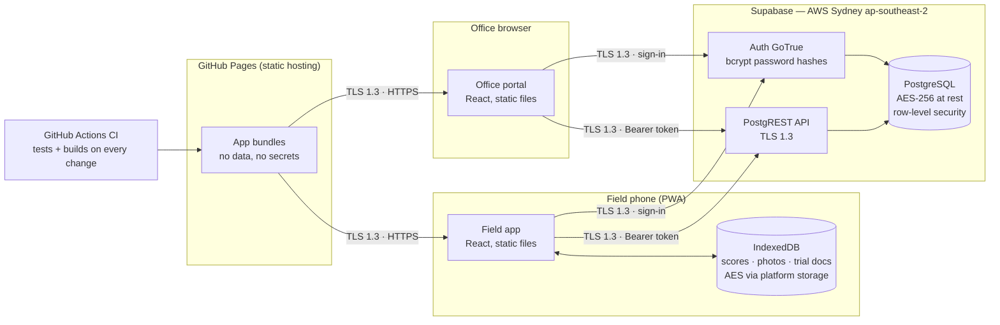

# Security configuration & data flow

The security documentation ITSP 11.0 requires ("data flow diagrams, security
configuration guides, and API documentation with schema and security
controls"). Companion to [`ITSP-COMPLIANCE.md`](ITSP-COMPLIANCE.md).

## Data flow

Build-time only (no runtime connection): APVMA product register via
data.gov.au; SILO daily climate (Qld Government). Photo *files* remain in
IndexedDB on the phone; only metadata rows sync.

## Trust boundaries and controls

| Boundary | Control |
|---|---|
| Internet → apps | Static files only; no server-side code to attack at the hosting layer |
| Apps → API | TLS 1.3; JWT bearer tokens from Auth; the embedded API key is the *publishable* key, privileged to nothing |
| API → data | **Row-level security in PostgreSQL** — every table policy scopes to the caller's org; enforced in the database, not the client |
| Account creation | Public sign-up disabled at the Auth layer; invitation allow-list (`allowed_signups`) checked by a `security definer` trigger before any org membership is granted |
| Roles | admin / agronomist / team / grower / rep defined in schema; grower+rep (customer-facing) **not enabled** — internal staff only |
| Photo storage | Org-partitioned bucket policies (`{org}/{trial}/{photo}` path scoping); no delete policy — photos are trial evidence |

## Secrets inventory

| Secret | Where it lives | Notes |
|---|---|---|
| Supabase publishable key | In the client bundles — **public by design** | Grants only what RLS allows; not a secret |
| Supabase database admin password | AGnVET 1Password (per ITSP 12.0 key-storage clause) | Never in the repo (CI-verified: secret scanning + scans) |
| GitHub Actions `GITHUB_TOKEN` | Ephemeral, per-run, GitHub-managed | `contents: write` only for the Pages deploy job |
| User passwords | bcrypt hashes inside Supabase Auth | Min 6 chars enforced; change-password in the app's Account screen |
| Encryption keys | **None held by the application** | All at-rest encryption is platform-managed |

## Secure-coding posture (verified claims)

- No SQL is constructed anywhere in the clients — all access via PostgREST
  parameterised endpoints under RLS (injection).
- Zero `innerHTML` / `dangerouslySetInnerHTML`; React auto-escaping throughout;
  print-view interpolations HTML-escaped (`src/exports/printouts.ts`) (XSS).
- Bearer-token auth, no ambient cookies (CSRF not applicable).
- Generic user-facing error messages; no stack traces surfaced.
- No custom cryptography; no MD5/SHA-1. The `stableId` FNV-style hash generates
  idempotent sync row identifiers and is **not a security function**.

## Pipeline controls

- Every push/PR: 65 automated checks, TypeScript type-check, both production
  builds; deploy only from `main` on green.
- CodeQL (SAST): every push/PR to main + weekly (`.github/workflows/codeql.yml`).
- Dependabot (SCA): weekly npm + Actions updates (`.github/dependabot.yml`).
- GitHub secret scanning: on (public repo default; push protection to be
  confirmed in repo settings).

## Residual items (tracked in ITSP-COMPLIANCE.md)

Staging environment · OWASP ASVS review with IT (draft self-assessment:
[`ASVS-L1-ASSESSMENT.md`](ASVS-L1-ASSESSMENT.md)) · penetration test ·
second-reviewer arrangement · formal change management · repo transfer to an
AGnVET GitHub organisation · EV-certificate question · Azure migration.
